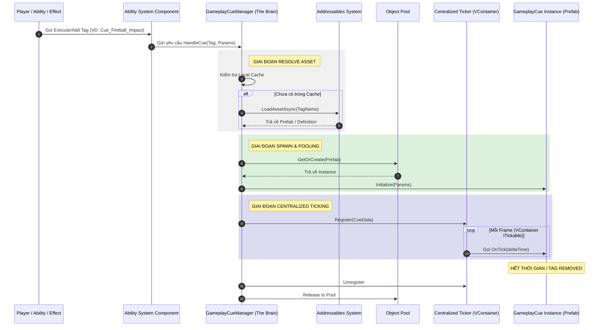

# Roadmap: Nâng cấp Hệ thống Gameplay Cue (Professional GAS)

Tài liệu này chi tiết hóa các bước nâng cấp hệ thống Gameplay Cue dựa trên tài liệu thiết kế `GAS_Cue_System_Design.md` và tiêu chuẩn tối ưu hóa `Network_Data_Optimization_Standard.md`.

---

## Phase 1: Hệ thống Tự động hóa Bitmask (Automated Bitmask Serialization)
**Mục tiêu**: Hiện thực hóa cơ chế "đóng gói thông minh" giúp tự động nén dữ liệu Payload dựa trên vùng nhớ, sẵn sàng cho Multiplayer AAA.

- [x] **Task 1.1**: Xây dựng `CueDataSchema`: Hệ thống Cache Metadata (Offset, Size của từng Field trong Struct) để tránh dùng Reflection ở Runtime.
- [x] **Task 1.2**: Hiện thực hóa bộ `BitmaskCompressor`:
    - Sử dụng `unsafe` pointer để so sánh vùng nhớ của Struct với giá trị mặc định (Zero-check).
    - Tự động xây dựng Header (Bitmask) dựa trên các Field có dữ liệu "Dirty" (khác 0).
- [x] **Task 1.3**: Cấu trúc lại `GameplayCueParameters`:
    - Thêm `byte[] RawPayload` để lưu trữ dữ liệu đã nén.
    - Triển khai hàm Generic `SetData<T>(T data)` và `GetData<T>()`.
- [x] **Task 1.4**: Cập nhật `GameplayCueParameters` để dùng `InstigatorID` (int) thay cho tham chiếu Class trực tiếp.

**Test Case**:
- Tạo `ExplosionData { float Radius; Vector3 Pos; }`. 
- Gán `Radius = 10, Pos = Vector3.zero`. `RawPayload` phải có kích thước đúng **5 bytes** (1 mask + 4 float).
- `GetData` phải trả về đúng `Radius = 10` và `Pos = zero`.

### Phân tích Hiệu năng & Ưu Nhược điểm (Phase 1)

**1. Ảnh hưởng đến CPU (Performance Cost):**
- **Cực thấp (Nanoseconds)**: Nhờ sử dụng `unsafe` pointer và `Memory Copy`, việc so sánh vùng nhớ diễn ra gần như tức thời.
- **Zero-Reflection at Runtime**: Reflection chỉ chạy 1 lần duy nhất khi game bắt đầu để lấy Metadata. Toàn bộ quá trình đóng gói sau đó là tính toán nhị phân thuần túy.
- **CPU vs Network Trade-off**: Chúng ta chấp nhận tốn thêm một vài chu kỳ CPU để giảm thiểu tối đa băng thông mạng. Trong môi trường Multiplayer, **băng thông là tài nguyên quý giá hơn CPU** rất nhiều.

**2. Ưu điểm:**
- **Tối ưu băng thông**: Chỉ gửi những gì cần thiết (giảm 50-90% dung lượng Payload).
- **Developer Experience**: Người lập trình chỉ việc dùng Struct, không cần quan tâm đến logic nén.
- **Sẵn sàng cho Multiplayer**: Dễ dàng tích hợp với mọi hệ thống Netcode.

**3. Nhược điểm:**
- **Độ phức tạp code hạ tầng**: Code của Phase 1 sẽ hơi khó đọc vì chứa nhiều `unsafe` và thao tác bit.
- **Hạn chế kiểu dữ liệu**: Chỉ hỗ trợ `unmanaged struct` (không chứa string, class).

---

## Phase 2: Registry Phi tập trung (UE-Style Definition)
**Mục tiêu**: Mỗi Cue là một Asset riêng biệt, tự quản lý và tự hướng dẫn Designer.

- [x] **Task 2.1**: Tạo class `GameplayCueDefinition` (ScriptableObject) đại diện cho một hiệu ứng.
- [x] **Task 2.2**: Hiện thực hóa `GameplayCueDefinitionEditor`: Kiểm tra lỗi tên, Addressable và hiển thị hướng dẫn trực quan ngay trên Inspector.
- [x] **Task 2.3**: Nâng cấp `GameplayCueManager` hỗ trợ tra cứu trực tiếp từ Addressables theo quy chuẩn tên Tag.

**Test Case**:
- Gọi `ExecuteGameplayCue` với một Tag, Manager phải tìm đúng Prefab đã đăng ký trong ScriptableObject và Instantiate nó ra scene.

---

## Phase 3: Hệ thống Notifier Siêu nhẹ (Lightweight Notifiers)
**Mục tiêu**: Chuyển đổi từ logic phân tán (nhiều `Update`) sang logic tập trung (Centralized Tick).

- [x] **Task 3.1**: Hiện thực hóa `GameplayCueNotify_Burst` & `Loop`: Không chứa hàm `Update`.
- [ ] **Task 3.2**: Tách biệt **Visual Component** (Chỉ chứa Particle/Sound) và **Logic Component** (Chỉ chứa Data).
- [ ] **Task 3.3**: Tích hợp `ICueTickable`: Giao tiếp giữa Manager và Prefab để xử lý logic theo frame mà không dùng Lifecycle của Unity.

**Workflow của Designer**:
1. Tạo `GameplayCueDefinition` (SO).
2. Tạo Prefab hiệu ứng, gắn `GameplayCueNotify` tương ứng.
3. **Lưu ý**: Tuyệt đối không viết hàm `Update` trong script của Cue. Mọi logic di chuyển hay biến đổi theo thời gian sẽ được Manager "gọi" (Tick).

---

## Phase 4: High-Performance Centralized Ticker (VContainer Integration)
**Mục tiêu**: Manager nắm quyền điều khiển toàn bộ, sử dụng Pooling và Ticking tập trung.

- [x] **Task 4.1**: Nâng cấp `GameplayCueManager` thành một **VContainer Service** (implement `ITickable`).
- [x] **Task 4.2**: Hiện thực hóa **Object Pooling**: Tái sử dụng Prefab, triệt tiêu `Instantiate/Destroy` để tránh Spike lag.
- [x] **Task 4.3**: **Centralized Update Loop**: Manager duyệt qua danh sách `ActiveCues` (struct-based) để cập nhật vị trí, thời gian và hiệu ứng Fade.

**Chuyện gì xảy ra khi gọi Cue?**
1. **Call**: `ASC.ExecuteGameplayCue(Tag, Params)`.
2. **Resolve**: Manager tìm `GameplayCueDefinition` (qua Addressables/Cache).
3. **Spawn**: Manager lấy Prefab từ **Pool**, đặt vào vị trí yêu cầu.
4. **Register**: Manager thêm một mẩu dữ liệu nhỏ (`CueInstanceData` - struct) vào danh sách đang hoạt động.
5. **Tick**: Mỗi frame, Manager chạy một vòng lặp `for` duy nhất để cập nhật toàn bộ các mẩu dữ liệu này.
6. **Cleanup**: Khi hết thời gian, Manager trả Prefab về **Pool** và xóa dữ liệu khỏi danh sách.

---

## Kiến trúc Hệ thống (System Architecture)
Dưới đây là luồng vận hành từ lúc gọi Tag đến khi hiệu ứng xuất hiện (Centralized Ticker Model):

---

## Phase 5: Addressables & Memory Management
**Mục tiêu**: Đảm bảo hiệu suất AAA cho các trận đánh lớn.

- [x] **Task 5.1**: Tích hợp **Unity Addressables** vào hệ thống Cue.
- [x] **Task 5.2**: Hiện thực hóa **Object Pooling** cho các Cue Notify.
- [x] **Task 5.3**: Quản lý bộ nhớ: Tự động Unload các Cue.

---

## Phase 6: GAS Unified Dashboard (Editor Pro)
**Mục tiêu**: Xây dựng một cửa sổ tập trung để quản lý toàn bộ hệ thống GAS.

- [x] **Task 6.1**: Thiết lập **GAS Dashboard Window**: Cửa sổ chính tích hợp thanh điều hướng.
- [x] **Task 6.2**: **Cue Library Manager**: 
    - [x] Liệt kê toàn bộ `GameplayCueDefinition` trong dự án.
    - [x] Kiểm tra trạng thái Addressables hàng loạt.
    - [x] Nút "Fix All" để tự động sửa tên Addressable theo chuẩn.
- [x] **Task 6.3**: **Ability & Effect Browser**: 
    - [x] Xem danh sách và chỉnh sửa nhanh các ScriptableObject.
- [x] **Task 6.4**: **Debug Monitor (Runtime)**: 
    - [x] Hiển thị danh sách các Cue đang "Active" trong Scene.
    - [x] Theo dõi hiệu suất Pooling và Ticking trực tiếp.

---

## Phase 7: Tích hợp & Kiểm chứng (Orb Combat Sample)
**Mục tiêu**: Áp dụng hệ thống mới vào Sample để verify toàn bộ quy trình.

- [x] **Task 7.1**: Cập nhật `OrbDebugUI` để sử dụng bộ Test toàn diện.
- [x] **Task 7.2**: Kiểm chứng quy trình: Pool -> Tick -> Addressables -> Dashboard.

- Chạy toàn bộ các Test Case trong `OrbDebugUI`, đảm bảo hình ảnh và âm thanh hoạt động mượt mà hơn và code logic sạch sẽ hơn.
